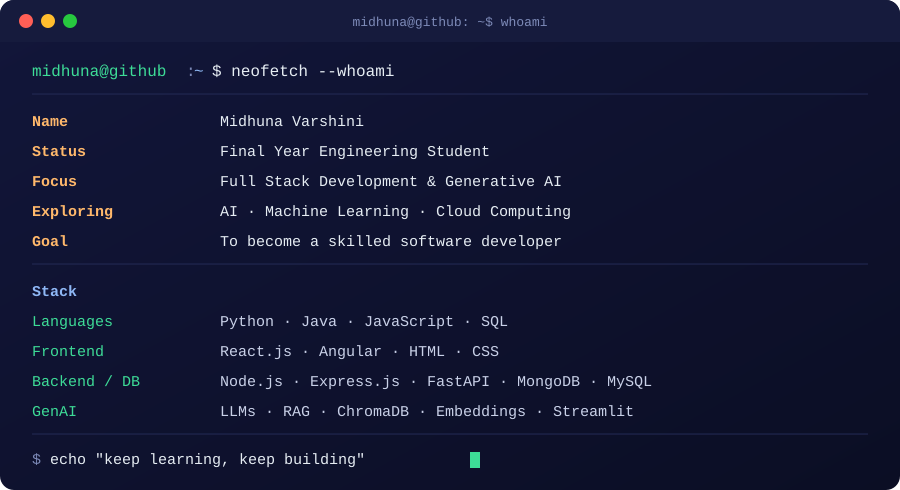

  

<h1>Midhuna Varshini S P</h1>

Final Year Student • Full Stack Developer • GenAI Learner

  
  
  
  

---

## 👩‍💻 About

I'm a final year engineering student passionate about building real-world applications using **Full Stack Development** and **Generative AI**.

Currently, I'm exploring how GenAI and LLMs can be used to build intelligent, context-aware systems that go beyond traditional applications.

I enjoy building end-to-end projects — from system design and architecture to debugging real-world issues and making things actually work.

---

## 🔭 Currently Building

### Nexus Know — Enterprise RAG Knowledge Assistant

An AI-powered system designed to process enterprise documents and deliver accurate, context-aware answers.

- 📄 Document ingestion (PDF / DOCX / PPTX)
- 🔍 Semantic search using embeddings + ChromaDB
- 🤖 Retrieval-Augmented Generation (RAG)
- 📎 Source-based citation for every response
- 🔐 Role-based access control

---

## 🧰 Tech Stack

### Languages

### Frontend

### Backend

### Database

### GenAI & Tools

### Cloud

---

## 📊 Coding Profiles

- 🧩 Solved problems on LeetCode with consistent practice  
- 💡 Active on HackerRank with strong problem-solving focus  

---

## 📊 GitHub Stats

---

## 🌱 Currently Learning

- Generative AI and LLM-based application development  
- Advanced RAG systems (retrieval, grounding, evaluation)  
- Embeddings and vector databases  
- Building AI apps using FastAPI and Streamlit  
- Designing scalable, production-ready GenAI systems  

---

## 📫 Connect

- 💼 LinkedIn: https://www.linkedin.com/in/midhuna-varshini/  
- 📧 Email: midhunavarshini192@gmail.com  

---

⭐ Always building • Always learning  

